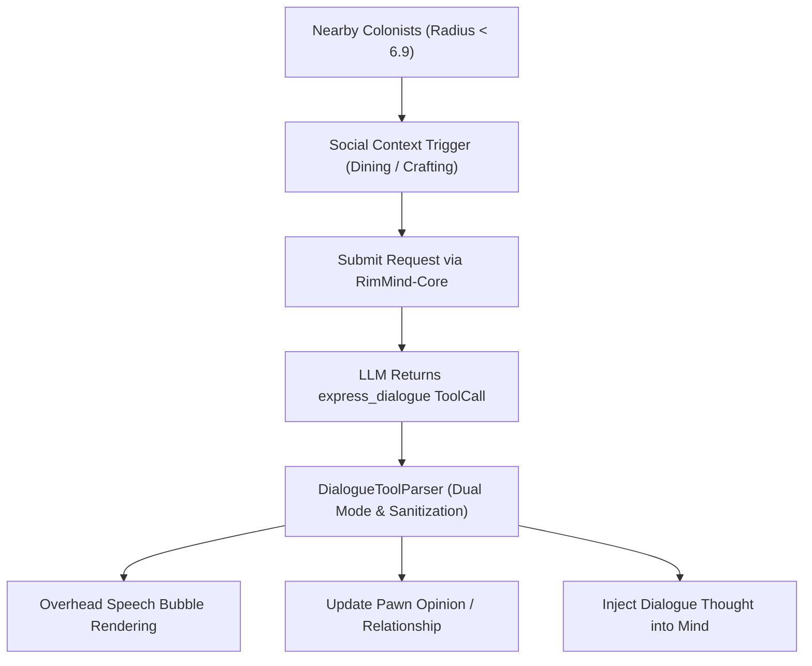

<div align="center">

# RimMind-Dialogue 💬
### Contextual Social Dialogue, Native Spoken ToolCalls & Overhead Bubbles for RimWorld 1.6

**English** | [简体中文](README_zh.md)

<p>
  <a href="https://rimworldgame.com/"></a>
  <a href="https://github.com/mcocdaa/RimWorld-RimMind-Mod-Core"></a>
  <a href="#"></a>
  <a href="LICENSE"></a>
</p>

<p><em>Imbue your colonists with spontaneous, context-aware conversations, natural banter, and evolving relationships.</em></p>

</div>

---

## 📖 Overview

**RimMind-Dialogue** brings RimWorld colonists to life through organic, natural spoken interactions. Powered by the native `express_dialogue` function call architecture, colonists talk to each other while eating in dining halls, laboring at craft benches, or resting by campfires.

### Core Capabilities
- **Native `express_dialogue` ToolCall**: Transmits spoken dialogue, internal psychological subtext, and relationship delta modifiers (`relation_delta: [-5, 5]`) as structured function parameters, completely eliminating JSON prompt leakage.
- **Contextual Spoken Triggers**: Conversational opportunities trigger organically based on physical proximity (radius 6.9 tiles), shared activities (dining, recreation), and mutual social opinions.
- **Dynamic Relationship Evolution**: Conversations dynamically impact mutual pawn opinions, fostering deep romances, bitter rivalries, or lasting camaraderie.
- **Smooth Overhead Speech Bubbles**: Renders text motes directly above colonists' heads with word wrapping and gentle fading animations.

---

## 🎮 In-Game Showcase


*Overhead spoken dialogue in the dining hall: Colonists share natural banter over a meal, with speech bubbles and live opinion adjustments.*

---

## 🏛️ Architecture & Dialogue ToolCall Flow



---

## 🛠️ Installation & Load Order

```text
1. Harmony
2. Core (Vanilla RimWorld)
3. RimMind-Core
4. RimMind-Dialogue
```

---

## 🧪 Developer Guide & Testing

Run unit tests covering dialogue schema parsing, arguments unescaping, and opinion delta boundaries:

```powershell
dotnet test RimMind-Dialogue/Tests/RimMindDialogue.Tests.csproj -c Release
```

---

## 📜 License

Licensed under the [MIT License](LICENSE).
