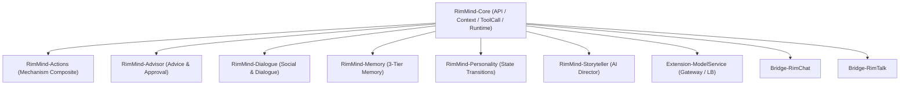

# RimMind - Dialogue

AI 驱动的对话系统，拦截游戏事件生成上下文 AI 对话，支持玩家主动发起对话，让殖民者真正"开口说话"。

## RimMind 是什么

RimMind 是一套 AI 驱动的 RimWorld 模组套件，通过接入大语言模型（LLM），让殖民者拥有人格、记忆、对话和自主决策能力。

## 子模组列表与依赖关系

| 模组 | 职责 | 依赖 | GitHub |
|------|------|------|--------|
| RimMind-Core | 公共 API、LLM 请求调度、4-Zone 上下文引擎、ToolCall 契约与运行时 | Harmony | [链接](https://github.com/RimWorld-RimMind-Mod/RimWorld-RimMind-Mod-Core) |
| RimMind-Actions | 将基础 ToolCall 组合成高级 Mechanism 动作 | Core | [链接](https://github.com/RimWorld-RimMind-Mod/RimWorld-RimMind-Mod-Actions) |
| RimMind-Advisor | 状态/Thought → 建议、审批、动作与反馈闭环 | Core | [链接](https://github.com/RimWorld-RimMind-Mod/RimWorld-RimMind-Mod-Advisor) |
| **RimMind-Dialogue** | **AI 驱动的对话系统与社交关系演进（express_dialogue）** | Core | [链接](https://github.com/RimWorld-RimMind-Mod/RimWorld-RimMind-Mod-Dialogue) |
| RimMind-Memory | 三层记忆系统（情景/摘要/反思）与时间上下文 | Core | [链接](https://github.com/RimWorld-RimMind-Mod/RimWorld-RimMind-Mod-Memory) |
| RimMind-Personality | 基于概率的状态跃迁驱动的人格与 Thought 注入 | Core | [链接](https://github.com/RimWorld-RimMind-Mod/RimWorld-RimMind-Mod-Personality) |
| RimMind-Storyteller | AI 叙事者，智能评估戏剧性曲线与事件选择 | Core | [链接](https://github.com/RimWorld-RimMind-Mod/RimWorld-RimMind-Mod-Storyteller) |
| RimMind-Bridge-RimChat | RimMind 与 RimChat 模组的协调与门控互斥 | Core, RimChat | [链接](https://github.com/RimWorld-RimMind-Mod/RimWorld-RimMind-Mod-Bridge-RimChat) |
| RimMind-Bridge-RimTalk | RimMind 与 RimTalk 模组的对话气泡与上下文桥 | Core, RimTalk | [链接](https://github.com/RimWorld-RimMind-Mod/RimWorld-RimMind-Mod-Bridge-RimTalk) |
| RimMind-Extension-ModelService | 扩展模型网关、OpenCode Go 订阅直连与多端点负载均衡 | Core | [链接](https://github.com/RimWorld-RimMind-Mod/RimWorld-RimMind-Mod-Extension-ModelService) |



## 安装步骤

### 从源码安装

**Linux/macOS:**
```bash
git clone git@github.com:RimWorld-RimMind-Mod/RimWorld-RimMind-Mod-Dialogue.git
cd RimWorld-RimMind-Mod-Dialogue
./script/deploy-single.sh <your RimWorld path>
```

**Windows:**
```powershell
git clone git@github.com:RimWorld-RimMind-Mod/RimWorld-RimMind-Mod-Dialogue.git
cd RimWorld-RimMind-Mod-Dialogue
./script/deploy-single.ps1 <your RimWorld path>
```

### 从 Steam 安装

1. 安装 [Harmony](https://steamcommunity.com/sharedfiles/filedetails/?id=2009463077) 前置模组
2. 安装 RimMind-Core
3. 安装 RimMind-Dialogue
4. 在模组管理器中确保加载顺序：Harmony → Core → Dialogue

## 快速开始

### 填写 API Key

1. 启动游戏，进入主菜单
2. 点击 **选项 → 模组设置 → RimMind-Core**
3. 填写你的 **API Key** 和 **API 端点**
4. 填写 **模型名称**（如 `gpt-4o-mini`）
5. 点击 **测试连接**，确认显示"连接成功"

### 体验对话

- **自动对话**：殖民者受伤、技能升级、心情变化时会自动生成内心独白
- **主动对话**：右键点击其他殖民者，选择"对话"选项；或点击殖民者身上的 Gizmo 按钮
- **对话浮窗**：屏幕角落实时显示最近对话

## 核心功能

### 事件驱动的 AI 对话

通过拦截游戏事件，触发 AI 生成上下文感知的对话：

| 触发来源 | 说明 | 类型 |
|----------|------|------|
| 社交互动 | 拦截原生 Chitchat/DeepTalk，替换为 AI 对话 | 对话 |
| 健康变化 | 受伤或生病时的反应 | 独白 |
| 技能升级 | 技能提升时的内心独白 | 独白 |
| 心情波动 | 心情变化超过阈值时的表达 | 独白 |
| 空闲自动 | 空闲时按间隔触发的独白 | 独白 |
| 玩家主动 | Gizmo 按钮 + 右键菜单对话选项 | 对话 |

### Thought 注入系统

对话产生的心理影响转化为游戏内 Thought，实际影响殖民者心情：

| 标签 | 心情值 | 说明 |
|------|--------|------|
| ENCOURAGED | +1 | 受到鼓励 |
| HURT | -1 | 感到受伤 |
| VALUED | +2 | 感到被重视 |
| CONNECTED | +2 | 感到亲近 |
| STRESSED | -2 | 感到压力 |
| IRRITATED | -1 | 感到烦躁 |

对话还可通过 `relation_delta` 改变小人间好感度（范围 -5 ~ +5），以 Thought 形式注入关系变化。

### 角色约束

根据小人身份自动添加语气约束：

| 角色 | 语气 |
|------|------|
| 囚犯 | 警惕、犹豫、乞求 |
| 奴隶 | 恐惧、顺从、称"主人" |
| 敌人 | 敌对、攻击性、威胁 |
| 访客 | 礼貌、好奇、恭敬 |

### 玩家主动对话

- Gizmo 按钮 + 右键菜单两种方式发起对话
- 支持多轮对话，保留会话历史
- 玩家输入与自动对话共用开关、AI 条件、Pawn/Pair 预约和并发上限；玩家多轮输入不消耗自动每日配额或独白冷却
- 关闭对话窗口会取消当前请求，失败或被门控拒绝后可以重新发送
- 对话回复链：A 对话后自动触发 B 的回复

### 对话日志

- 分类查看：殖民者独白/对话、非殖民者独白/对话、玩家对话
- 对话以双栏视图展示，独白以列表视图展示
- 浮窗覆盖：屏幕角落实时显示最近对话，支持拖拽和缩放

## Mod 开发者 API

RimMind-Dialogue 提供以下公共 API 供其他 mod 集成：

| API | 说明 |
|-----|------|
| `RimMindDialogueService.OnDialogueCompleted` | 对话完成事件，签名 `(Pawn, Pawn?, string, string?)` |
| `RimMindDialogueService.GetDialogueHistory(pawnId, maxCount)` | 查询指定小人的对话历史 |
| `RimMindDialogueService.RegisterTriggerType(typeId, labelKey)` | 注册自定义触发类型标签翻译 |
| `ThoughtInjector.RegisterThoughtTag(tag, moodOffset, labelKey)` | 注册自定义 Thought 标签及心情映射 |

## 设置项

| 设置 | 默认值 | 说明 |
|------|--------|------|
| 启用对话系统 | 开启 | 总开关 |
| 拦截原生闲聊 | 开启 | 将 Chitchat/DeepTalk 替换为 AI 对话 |
| 健康变化反应 | 开启 | 受伤/生病时触发独白 |
| 技能升级反应 | 开启 | 技能提升时触发独白 |
| 心情变化反应 | 开启 | 心情波动超过阈值时触发独白 |
| 心情变化阈值 | 3 | 触发独白的最小心情变化绝对值 |
| 空闲自动独白 | 开启 | 空闲时按间隔触发独白 |
| 空闲自动独白间隔 | 12 游戏小时 | 自动独白的最小间隔 |
| 玩家主动对话 | 开启 | Gizmo 按钮 + 右键菜单对话选项 |
| 独白冷却 | 10 游戏小时 | 同一小人同类型独白的最小间隔 |
| 每日每对最大对话轮数 | 6 | 每对殖民者每天最多对话轮数 |
| AI对话历史保留轮数 | 20 | ⚠️ 预留设置，当前版本未生效 |
| 全局对话并发上限 | 3 | 玩家与自动请求共享的 Dialogue 在途上限，同时受 Core 全局队列限制 |
| 启用对话回复 | 开启 | 收到对话后自动生成回复 |
| 游戏开始延迟 | 10 秒 | 加载存档后暂不触发对话 |
| 注入 Thought 时显示通知 | 关闭 | 注入心情 Thought 时屏幕通知 |
| 显示对话浮窗 | 开启 | 屏幕角落实时对话 |
| 浮窗透明度 | 75% | 浮窗不透明度 |
| 浮窗最大消息数 | 8 | 浮窗同时显示的最大对话条数 |

## 常见问题

**Q: 对话会影响游戏性能吗？**
A: 不会。所有 AI 请求异步执行，并发数由 RimMind-Core 统一控制，各类触发均有冷却机制。

**Q: 配合 Memory 模组效果更好吗？**
A: 是的。安装 RimMind-Memory 后，对话内容会自动写入记忆系统，让 AI 在后续对话中参考历史。

**Q: 可以只开启部分触发类型吗？**
A: 可以。在模组设置中可单独开关每种触发类型。

**Q: 对话浮窗可以移动位置吗？**
A: 可以直接拖拽浮窗标题栏移动位置，拖拽右下角调整大小，位置和大小会自动保存。

**Q: 全局并发上限在哪里设置？**
A: Dialogue 设置控制玩家与自动对话共享的在途上限；Core 设置还控制整个套件的全局并发。

## 致谢

本项目开发过程中参考了以下优秀的 RimWorld 模组：

- [RimTalk](https://github.com/jlibrary/RimTalk.git) - 对话系统参考
- [RimTalk-ExpandActions](https://github.com/sanguodxj-byte/RimTalk-ExpandActions.git) - 动作扩展参考
- [NewRatkin](https://github.com/solaris0115/NewRatkin.git) - 种族模组架构参考
- [VanillaExpandedFramework](https://github.com/Vanilla-Expanded/VanillaExpandedFramework.git) - 框架设计参考

## 贡献

欢迎提交 Issue 和 Pull Request！如果你有任何建议或发现 Bug，请通过 GitHub Issues 反馈。


---

# RimMind - Dialogue (English)

An AI-driven dialogue system that intercepts game events to generate contextual AI conversations, supports player-initiated dialogue, and makes colonists truly "speak".

## What is RimMind

RimMind is an AI-driven RimWorld mod suite that connects to Large Language Models (LLMs), giving colonists personality, memory, dialogue, and autonomous decision-making.

## Sub-Modules & Dependencies

| Module | Role | Depends On | GitHub |
|--------|------|------------|--------|
| RimMind-Core | Public API, LLM scheduling, 4-Zone context engine, ToolCall contracts & runtime | Harmony | [Link](https://github.com/RimWorld-RimMind-Mod/RimWorld-RimMind-Mod-Core) |
| RimMind-Actions | High-level Mechanism composite actions from atomic ToolCalls | Core | [Link](https://github.com/RimWorld-RimMind-Mod/RimWorld-RimMind-Mod-Actions) |
| RimMind-Advisor | Thought/Status → advice, player approval, action & feedback loop | Core | [Link](https://github.com/RimWorld-RimMind-Mod/RimWorld-RimMind-Mod-Advisor) |
| **RimMind-Dialogue** | **Context-aware AI dialogue & social relationship dynamics (express_dialogue)** | Core | [Link](https://github.com/RimWorld-RimMind-Mod/RimWorld-RimMind-Mod-Dialogue) |
| RimMind-Memory | 3-tier memory system (Episodic/Summary/Reflection) & temporal context | Core | [Link](https://github.com/RimWorld-RimMind-Mod/RimWorld-RimMind-Mod-Memory) |
| RimMind-Personality | Probabilistic state-transition driven personality & Thought injection | Core | [Link](https://github.com/RimWorld-RimMind-Mod/RimWorld-RimMind-Mod-Personality) |
| RimMind-Storyteller | AI storyteller, dynamic dramatic tension & incident selection | Core | [Link](https://github.com/RimWorld-RimMind-Mod/RimWorld-RimMind-Mod-Storyteller) |
| RimMind-Bridge-RimChat | Coordination & mutual exclusion layer with RimChat mod | Core, RimChat | [Link](https://github.com/RimWorld-RimMind-Mod/RimWorld-RimMind-Mod-Bridge-RimChat) |
| RimMind-Bridge-RimTalk | Dialogue bubbles & context bridge with RimTalk mod | Core, RimTalk | [Link](https://github.com/RimWorld-RimMind-Mod/RimWorld-RimMind-Mod-Bridge-RimTalk) |
| RimMind-Extension-ModelService | Extended model gateway, OpenCode Go subscription & multi-endpoint load balancing | Core | [Link](https://github.com/RimWorld-RimMind-Mod/RimWorld-RimMind-Mod-Extension-ModelService) |

## Installation

### Install from Source

**Linux/macOS:**
```bash
git clone git@github.com:RimWorld-RimMind-Mod/RimWorld-RimMind-Mod-Dialogue.git
cd RimWorld-RimMind-Mod-Dialogue
./script/deploy-single.sh <your RimWorld path>
```

**Windows:**
```powershell
git clone git@github.com:RimWorld-RimMind-Mod/RimWorld-RimMind-Mod-Dialogue.git
cd RimWorld-RimMind-Mod-Dialogue
./script/deploy-single.ps1 <your RimWorld path>
```

### Install from Steam

1. Install [Harmony](https://steamcommunity.com/sharedfiles/filedetails/?id=2009463077)
2. Install RimMind-Core
3. Install RimMind-Dialogue
4. Ensure load order: Harmony → Core → Dialogue

## Quick Start

### API Key Setup

1. Launch the game, go to main menu
2. Click **Options → Mod Settings → RimMind-Core**
3. Enter your **API Key** and **API Endpoint**
4. Enter your **Model Name** (e.g., `gpt-4o-mini`)
5. Click **Test Connection** to confirm

### Experience Dialogue

- **Auto Dialogue**: Colonists generate inner monologues when injured, leveling skills, or experiencing mood changes
- **Player Dialogue**: Right-click another colonist and select "Dialogue", or click the Gizmo button
- **Dialogue Overlay**: Real-time dialogue display in screen corner

## Key Features

- **Event-Driven AI Dialogue**: Intercepts game events (social, health, skill, mood) to trigger contextual AI conversations
- **Thought Injection**: Dialogue impacts are injected as in-game Thoughts, actually affecting colonist mood; dialogue can also change opinion between pawns via `relation_delta`
- **Role Constraints**: Automatically adds tone constraints for Prisoner/Slave/Enemy/Visitor pawns
- **Player-Initiated Dialogue**: Gizmo button + right-click context menu, with multi-turn history
- **Shared Request Lifecycle**: Player and automatic requests share enablement, AI gates,
  Pawn/pair reservations and concurrency limits. Player turns do not consume automatic
  daily quotas or monologue cooldowns; closing the window cancels its pending request.
- **Dialogue Reply Chain**: Automatic reply generation creates two-way conversations
- **Dialogue Log**: Categorized log with dual-column dialogue view and real-time overlay

## Mod Developer API

RimMind-Dialogue provides public APIs for other mods to integrate:

| API | Description |
|-----|-------------|
| `RimMindDialogueService.OnDialogueCompleted` | Dialogue completion event, signature `(Pawn, Pawn?, string, string?)` |
| `RimMindDialogueService.GetDialogueHistory(pawnId, maxCount)` | Query dialogue history for a specific pawn |
| `RimMindDialogueService.RegisterTriggerType(typeId, labelKey)` | Register custom trigger type label translation |
| `ThoughtInjector.RegisterThoughtTag(tag, moodOffset, labelKey)` | Register custom Thought tag with mood mapping |

## FAQ

**Q: Will dialogue affect game performance?**
A: No. All AI requests are async with concurrency controlled by RimMind-Core, and each trigger type has cooldown mechanisms.

**Q: Does it work better with Memory?**
A: Yes. With RimMind-Memory installed, dialogue content is automatically saved to the memory system for AI to reference in future conversations.

**Q: Can I enable only certain trigger types?**
A: Yes. Each trigger type can be toggled individually in mod settings.

**Q: Can I move the dialogue overlay?**
A: Yes. Drag the title bar to move, drag the bottom-right corner to resize. Position and size are saved automatically.

**Q: Where is the global concurrent limit?**
A: Dialogue settings cap pending player and automatic dialogue requests together;
Core settings additionally cap concurrency across the whole suite.

## Acknowledgments

This project references the following excellent RimWorld mods:

- [RimTalk](https://github.com/jlibrary/RimTalk.git) - Dialogue system reference
- [RimTalk-ExpandActions](https://github.com/sanguodxj-byte/RimTalk-ExpandActions.git) - Action expansion reference
- [NewRatkin](https://github.com/solaris0115/NewRatkin.git) - Race mod architecture reference
- [VanillaExpandedFramework](https://github.com/Vanilla-Expanded/VanillaExpandedFramework.git) - Framework design reference

## Contributing

Issues and Pull Requests are welcome! If you have any suggestions or find bugs, please feedback via GitHub Issues.
