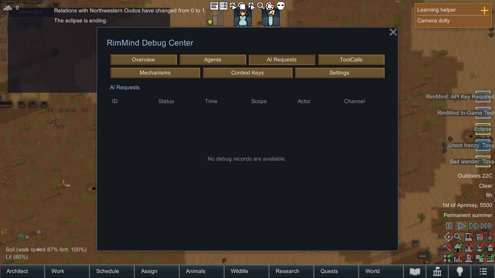
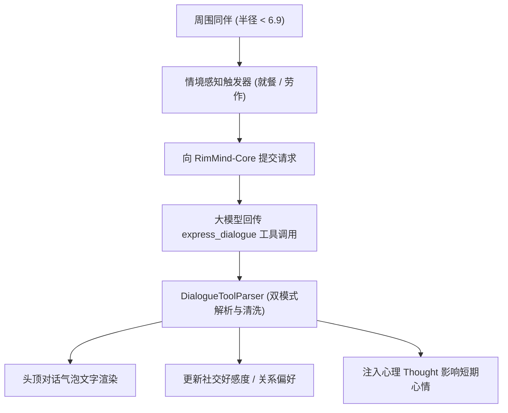

<div align="center">

# RimMind-Dialogue 💬
### 专为 RimWorld 1.6 打造的情境社交对白、原生 ToolCall 台词与头顶气泡系统

[English](README.md) | **简体中文**

<p>
  <a href="https://rimworldgame.com/"></a>
  <a href="https://github.com/mcocdaa/RimWorld-RimMind-Mod-Core"></a>
  <a href="#"></a>
  <a href="LICENSE"></a>
</p>

<p><em>为边缘世界的殖民者赋予自然生动的闲聊吐槽、真情流露与社交关系演化。</em></p>

</div>

---

## 📖 模块概览

**RimMind-Dialogue** 让殖民者之间的交流变得充满人情味。基于原生 `express_dialogue` 函数调用契约，小人们在食堂用餐、工作台做工或篝火旁休憩时能够自然产生有话则长、无话则短的情境闲聊。

### 核心特性
- **原生 `express_dialogue` 工具调用**：台词内容、潜台词心理活动以及好感变动值（`relation_delta: [-5, 5]`）作为标准化结构参数回传，彻底杜绝原始 JSON 字符泄露在头顶气泡中。
- **情境社交触发感知**：基于物理半径（6.9 格范围内近距接触）、共同活动（就餐、娱乐、并肩劳作）与当前社交关系自然投骰触发。
- **动态社交关系演进**：对话不仅停留在文本层面，还会实质性影响殖民者之间的好感度，促成深厚友谊、浪漫恋情或宿命敌对。
- **平滑头顶气泡渲染**：支持自适应折行、渐变浮现与平滑消隐动画，提供生动的视听沉浸体验。

---

## 🎮 实机特性展示


*食堂就餐闲聊实机场景：殖民者共进晚餐时边吃边聊，头顶升起气泡并伴随好感度实时动态变动。*

---

## 🏛️ 系统架构与对白流转



---

## 🛠️ 安装与加载顺序

```text
1. Harmony
2. Core (RimWorld 原版)
3. RimMind-Core
4. RimMind-Dialogue
```

---

## 🧪 开发者测试指南

运行单元测试（涵盖 Schema 校验、JSON 转义防御与数值边界截断）：

```powershell
dotnet test RimMind-Dialogue/Tests/RimMindDialogue.Tests.csproj -c Release
```

---

## 📜 开源协议

本项目采用 [MIT License](LICENSE) 开源许可证。
